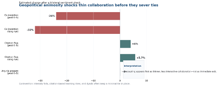

# Geopolitics and the Decoupling of International Innovation Networks
### How Bilateral Animosity Reconfigures Collaboration and Learning

---

**Research Stage:** Analysis

> When bilateral relations sour, cross-border innovation does not always break cleanly. It often thins first. Combining a directional media-sentiment index with patent-based measures of co-invention and citation flows, this project shows how animosity shocks push innovation networks away from joint production and toward more arm's-length learning.

---

## Why Now

Technology rivalry rarely begins with an official break. It more often appears first as thinner, more fragile collaboration — the kind of quiet decoupling firms struggle to see in time.

---

## Project Description

In policy circles, "decoupling" often sounds like a switch: one day a cross-border collaboration is allowed, the next day it is not. This project shows a subtler reality. In international innovation networks, geopolitical stress frequently works by changing the depth of relationships before it changes their existence. The most important damage may happen while ties still appear intact.

The project links bilateral animosity shocks — measured as sharp negative shifts in one country's media tone toward another — to two core channels of international innovation. The first is cross-border co-invention, which captures joint knowledge production across inventor teams. The second is citation-based knowledge flow, which captures learning from foreign inventions through public disclosure. That dyadic design makes it possible to trace how political friction reorganizes the microstructure of innovation networks rather than simply asking whether global innovation rises or falls overall.

The core result is striking. After an animosity shock, co-invention intensity between the affected country pair declines by about 24 percent on average and by roughly 32 percent in the longer run, yet the probability that the pair maintains any tie at all changes little. At the same time, citation-based knowledge flows rise by about 4 percent on average and 5.7 percent in the longer run. The implication is not that learning stops. It shifts from trust-dependent collaboration toward more arm's-length observation and recombination. For firms, this means that innovation decoupling often begins as thinning rather than exit. For scholars, it shows how geopolitics changes not only how much knowledge moves across borders, but the channels through which it moves.

---

## Visuals

*Figure 1: Taiwan Semiconductor Manufacturing Co. Fab 12B at dusk, one of the strategic infrastructures around which contemporary innovation rivalry is organized. Photo credit: 曾成訓 / Wikimedia Commons (CC BY 2.0).*

---

*Figure 2: Estimated post-shock changes in bilateral innovation channels after an animosity shock. Values draw from the project draft and are presented for website communication.*
